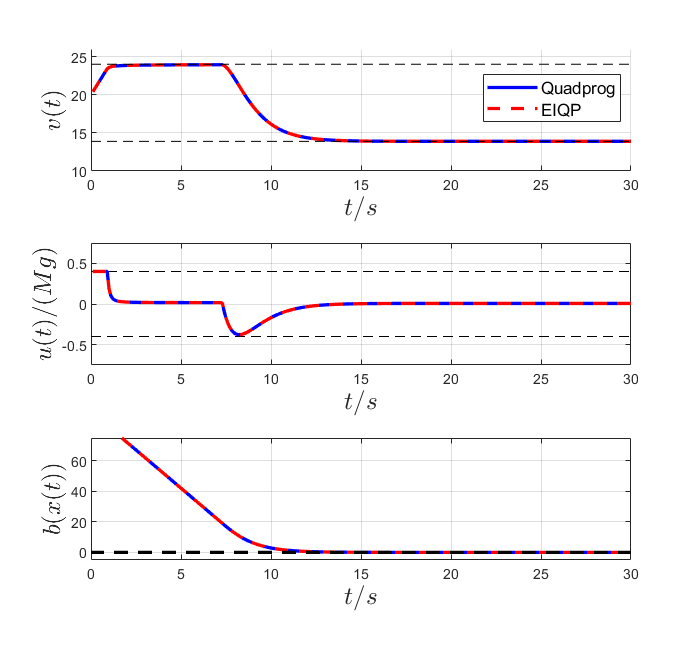

# What is EIQP
EIQP is designed to solve real-time convex quadratic programming (QP), **including linear programming (LP)**, with **execution time certificates** and **infeasibility detection**. 

In real-time scenarios, QP (or LP) is always solved repeatedly at each sampling time (feedback time), thus we need to ensure that the employed QP (or LP) algorithm can 100% return an optimal solution within a predefined optimality level (unlike other QP (or LP) solvers set a maximum iteration, a cheating approach) or detect the possible infeasibility before the next sampling time. 

This execution time certificate remains an open challenging problem for decades. The iteration complexity of EIQP is proved to be exact (rather the upper bound), simple-calculated, and data-independent, with the value 

**$\left\lceil\frac{\log(\frac{n+1}{\epsilon})}{-\log(1-\frac{0.414213}{\sqrt{n+1}})}\right\rceil$** 

(where $n$ and $\epsilon$ denote the number of constraints and the predefined optimality level, respectively), making it appealing to certify the execution time of online time-varying convex QPs (or LPs).

Details can be seen in the paper "EIQP: Execution-time-certified and Infeasibility-detecting QP Solver", available at https://arxiv.org/pdf/2502.07738.

# How to use EIQP
EQIP solves the convex QP: 

**$\min \frac{1}{2} z^\top Q z + z^\top c,~\text{s.t.}~Az\geq b,~z\geq0$**

when $Q=0$, it becomes an LP.

Our Mex-C implementation is a Matlab interface and its usage is:

[z,status]=EIQP(Q,c,A,b,epsilon), where epsilon denotes the optimality level, such as 1e-6,1e-8.

Before that, you need to compile it in Matlab

(1) for macOS/Linux: mex -O EIQP.c -lblas -llapack

(2) for Windows: mex -O EIQP.c -lmwblas -lmwlapack

We also provide the Julia interface and Python interface, see subfolders ./Julia_interface_tutorial and ./Python_interface_tutorial.

## Questions and issues, please contact
liangwu@mit.edu

# ACC case study
Compare with QuadProg in Matlab2024b (with interior-point or active-set algorithms), Run the following in Matlab

EIQP is about 5 times faster than the QuadProg in Matlab2024b for the ACC example on our Mac mini (Apple M4 Chip).
```
acc_main.m
```
 

